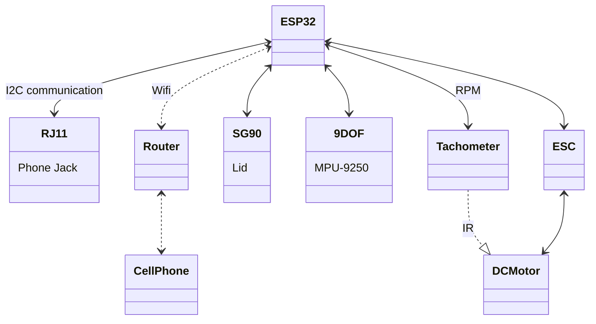
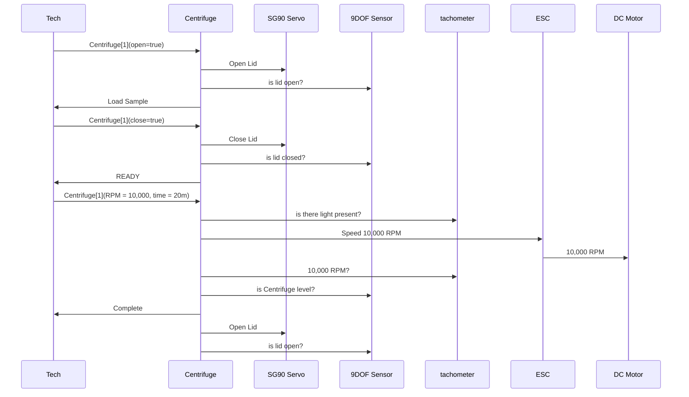

# Introduction
A centrifuge is a device that uses centrifugal force to separate various components of a fluid. This is achieved by spinning the fluid at high speed within a container, thereby separating fluids of different densities or liquids from solids. [Wikipedia](https://en.wikipedia.org/wiki/Centrifuge)

This document outlines the engineering URS, physics, design, bill of materials, fabrication, electronics, and coding of the Ce11 centrifuge.

### Table of Contents
[URS](#urs)
[Physics](#physics)
[Design](#design)
[Bill of Materials](#bill_of_material)
[Electronics](#electronics)
[Coding](#code)
[Modeling](#modeling)
[Fabrication](#fabrication)
[Operations](#operation)
[Notes](#notes)

# [URS](#urs)

**User Requirement Specifications**
A list of requirements that need to be met.

| Constraints | Approach | Achieved |
| --- | --- | --- |
| Size: | Fits inside Cellerator |     |
| Depth: | 126mm (5 inch) |     |
| Height: | 126mm (5 inch) |     |
| Width: | 162mm (6.3 inch)|     |
| Weight: | Reasonable Shipping Rates <$50 |     |
| Cost: | <$200 |     |
| Power | 120 AC Input, Output 12V DC, 5V DC, 3.3V DC |     |
| Decibels | 60 decibels |     |
| Capacity | 4 5mL vials |     |
| Geometry | Rectangular |     |
| Case | Laser cut, t-cut slots for screws|     |
| Assemble | Modular for expansion and portability |     |

# [Physics](#physics)

In a liquid suspension, many particles or cells will gradually fall to the bottom of the container due to gravity; however, the amount of time taken for such separations is not feasible. Other particles, which are very small, can not be isolated at all in solution until they are exposed to a high centrifugal force. As the suspension is rotated at a certain speed or revolutions per minute (RPM), the centrifugal force allows the particles to travel radially away from the rotation axis. The general formula for calculating the revolutions per minute (RPM) of a centrifuge is: 

Kv = refers to the constant velocity of a motor (not to be confused with “kV,” the abbreviation for kilovolt). It is measured by the number of revolutions per minute (rpm) that a motor turns when 1V (one volt) is applied with no load attached to that motor. The Kv rating of a brushless motor is the ratio of the motor’s unloaded rpm to the peak voltage on the wires connected to the coils.

### Kv to Voltage
RPM = Kv x Voltage
$1400 (Kv) * 10 (VDC) = 14,000 RPM$
- Motor Values
- number of Poles: 14
- Max Watts: 180W


### Measuring Motor RPM
$RPM=(120 \times frequency) \div (NumberMotorPoles)$


### Centrifugal Force
$F = mw^2r$
- F= centrifugal force
- m = mass
- w = ancular velocity
- r = distance from the orgin

### Revolutions Per Minutes
$RPM = \sqrt{g\div r}$
- RPM = revolutions per minute
- g = respective force
- r = radius

# [Design](#design)
First, the centrifuge checks if it is connected as a slave to the I2C network, then it will check if it is connected to the wifi network.  Using a microcontroller the centrifuge will check for saved network credentials, if this is false or if the saved network is not found then the centrifuge turns into an access point.  The user accesses the access point via the QR code located on the top of the device.  The access point allows the user to enter the wifi name and password to be saved locally on EEPROMs.  Once the centrifuge is connected to the wifi network, it switches to node mode.  In the node mode, it will display the centrifuge functionality.  The operation of the centrifuge starts with the open function.  This function uses an SG90 servo controlled by the microcontroller to open the lid.  The opening of the lid is verified by a 9 degree of freedom (9DOF) sensor. The 9DOF will return the angle of the lid verifying that it is in the correct orientation.  Once open the rotor with its four swing arms is visible.  Each swing arm allows for a 5mL vial.  When loaded the weight needs to be balanced on the corresponding sides.   After loading, the close function is activated and the SG90 serovo closes the lid and the 9DOF sensor verifies the action.  Once closed, the centrifucation fuction is activated. The microcontroller communicates with the electronic speed controller suppying the speed infomration and power to the brushless DC motor.  As the DC motor spins, the speed is verified using an IR tachometer sensor.  The IR tachometer conveys the speed back to the microcontroller.  Durning the operation of the centrifuge the 9DOF sensor is used to verify the centrfiuge is operating safley.  If the centrfigue is un-blanaced this will be caught by the 9DOF sensor triggering the stop of the centrfigue.  If the door opens the 9DOF sensor will trigger and the centrifuge will stop.  Lastly, if the unit is moved durning operation, the 9DOF sensor will trigger the stop.


# [Bill of Materials](#bill_of_material)

[Google Sheet](https://docs.google.com/spreadsheets/d/1qvB1pArQTkr_LnqSCreSQW6IO39-D-5EQn6YCgjRwPo/edit#gid=0)
| Qty | Name | Pieces | Cost | Total | Supplier |
| --- | --- | --- | --- | --- | --- |
| 1 | ESP32 | 3 | 18.99 | 6.32 | [Amazon](https://amzn.to/3C2okuT) |
| 1 | Brushless Motor | 1 | 21.88 | 21.88 | [Amazon](https://amzn.to/31ZC21x) |
|  | ESC Electronic Speed Controller | 1 |  | 0 | Amazon |
| 1 | SG90 Servo | 12 | 20.99 | 1.75 | [Amazon](https://amzn.to/3dx4Rby) |
| 1 | 9DOF sensor (MPU-9250) | 1 | 15.99 | 15.99 | [Amazon](https://amzn.to/3SN1f5b) |
| 1 | Centrifuge Housing | 1 | 40 | 40 | Acrylic Sheet |
| 1 | Rotor | 1 | 10 | 10 |  |
| 1 | Tachometer | 10 | 7.99 | 0.799 | [Amazon](https://amz.run/5rMO) |
| 1 | RJ11 Port | 6 | 9.99 | 1.665 | [Amazon](https://amzn.to/3dyWw3U) |
|  | **Total** |  |  | **98.41** |  |

# [Electronics](#electronics)

### Electronics Overview


[Centrifuge Model using Woki](www.wokwi.com)


BGNing A2212 1400kv Brushless Outrunner Motor 10t+ 30a Speed Controller ESC,Rc Aircraft Kk Quadcopter UFO (1 Pack)
[DC Brushless Motor](https://www.amazon.com/gp/product/B00PXVG7VM/ref=ppx_yo_dt_b_search_asin_title?ie=UTF8&psc=1)
$21.88
10VDC
A2212 1400KV MOTOR
KV: 1400
Max Efficiency: 80%
Max Efficiency Current: 4-10A (>75%)
Current Capacity: 12A/60s
No Load Current @ 10V: 0.5A
No. Of Cells: 2-3 Li-Poly
Motor Dimensions: 27.5 x 30mm
Shaft Diameter: 3.17mm
Weight: 47g
DT-30A Brushless ESC


# [Code](#code)
Functions
- [ ] Accesspoint [Accessport](#accessport)
- [ ] Webpage [Webpage](#webpage)
- [x] door servo [Door Servo](#door_servo)
- [x] Tilt sensor [Tilt sensor](#tilt_sensor)
- [x] tachometer sensor [Tachometer Sensor](#tachometer_sensor)
- [ ] Centrifuge [Centrifuge](#centrifuge)
- [ ] I2C [i2c](#i2c)

| ESC| ESP32|
| --- | --- |
| 5V (<span style="color: red;">RED</span>) |5V DC |
| SIG(==Yellow==) |G13(Blue)| 
| GND(<span style="color: orange;">Orange</span>) | GND |

| SG90| ESP32|
| --- | --- |
| 5V (<span style="color: red;">RED</span>) |5V DC |
| SIG(==Yellow==) |G27(Blue)| 
| GND(<span style="color: orange;">Orange</span>) | GND |

| Tachometer| ESP32|
| --- | --- |
| 5V (<span style="color: red;">RED</span>) |5V DC |
| SIG(==Yellow==) |G15(Blue)| 
| GND(<span style="color: orange;">Orange</span>) | GND |

| Temp Humidity Sensor| ESP32|
| --- | --- |
| 5V (<span style="color: red;">RED</span>) | 5V DC |
| GND(<span style="color: black;">Black</span>) | GND |
| SCL(==Yellow==) |G22|
| SDA(<span style="color: green;">Green</span>) |G21|

| 9DOF MPU-9250| ESP32|
| --- | --- |
| 5V (<span style="color: red;">RED</span>) | 5V DC |
| GND(<span style="color: black;">Black</span>) | GND |
| SCL(==Yellow==) |G22|
| SDA(<span style="color: green;">Green</span>) |G21|

| RJ11 I2C| ESP32|
| --- | --- |
| 5V (<span style="color: red;">RED</span>) | 5V DC |
| GND(<span style="color: black;">Black</span>) | GND |
| SCL(==Yellow==) |G22|
| SDA(<span style="color: green;">Green</span>) |G21|


Sequence Diagram of the Centrifuge software.


---
## Servo[](#)

Servo Functions
[Research](https://www.electronics-lab.com/project/using-sg90-servo-motor-arduino/)

### Pins


<details open="open"><summary>Arduino CODE</summary>

```cpp
#include <Servo.h>

Servo servo;
int angle = 10;

void setup() {
  servo.attach(8);
  servo.write(angle);
}


void loop() 
{ 
 // scan from 0 to 180 degrees
  for(angle = 10; angle < 180; angle++)  
  {                                  
    servo.write(angle);               
    delay(15);                   
  } 
  // now scan back from 180 to 0 degrees
  for(angle = 180; angle > 10; angle--)    
  {                                
    servo.write(angle);           
    delay(15);       
  } 
}
```
</details>

---
## [ESP32 Webpage](#webpage)

### Pins

| ESP32 | SG90 Servo |
| --- | --- |
| VIN | 5V (<span style="color: red;">RED</span>) |
|   | SIG(==Yellow==) |
| GND | GND(<span style="color: orange;">Orange</span>)) |

<details open="open"><summary>Arduino CODE</summary>

```cpp

```
</details>

---
## [I2C](#i2c)
### Pins
[Research from DroneBot](https://dronebotworkshop.com/i2c-arduino-arduino/)
| Arduino | RJ11 Pins |
| --- | --- |
| VIN | 5V (<span style="color: red;">RED</span>) |
| SDA (default is GPIO 21)  | SDA(==Yellow==) |
| SCL (default is GPIO 22)  | SCL(<span style="color: green;">Green</span>) |
| GND | GND(<span style="color: orange;">Orange</span>) |

<details open="open"><summary>Arduino CODE</summary>

```cpp
// Include Arduino Wire library for I2C
#include <Wire.h>
 
// Define Slave I2C Address
#define SLAVE_ADDR 9
 
// Define Slave answer size
#define ANSWERSIZE 5
 
void setup() {
 
  // Initialize I2C communications as Master
  Wire.begin();
  
  // Setup serial monitor
  Serial.begin(9600);
  Serial.println("I2C Master Demonstration");
}
```

</details>

---
## [Tachometer](#tachometer)
### Pins

IR Sensor Module Pin -GND —— GND
IR Sensor Pin +VCC —— VCC
IR Sensor Pin OUT — Arduino Pin D9

| Arduino | SG90 Servo |
| --- | --- |
| VIN | 5V (<span style="color: red;">RED</span>) |
| D8  | SIG(==Yellow==) |
| GND | GND(<span style="color: orange;">Orange</span>)) |

<details open="open"><summary>Arduino CODE</summary>

```cpp
#include <LiquidCrystal.h>
LiquidCrystal lcd(7, 6, 5, 4, 3, 2);
#define sensor 9
#define start 12
int delay1()
{
//unsigned int long k;
int i,j;
unsigned int count=0;
for(i=0;i<1000;i++)
{
for(j=0;j<1000;j++)
{
if(digitalRead(sensor))
{
count++;
while(digitalRead(sensor));
}
}
}
return count;
}
void setup()
{
pinMode(sensor, INPUT);
pinMode(start, INPUT);
pinMode(2, OUTPUT);
lcd.begin(16, 2);
lcd.print(” Tachometer”);
delay(2000);
digitalWrite(start, HIGH);
}
void loop()
{
unsigned int time=0,RPM=0;
lcd.clear();
lcd.print(” Please Press “);
lcd.setCursor(0,1);
lcd.print(“Button to Start “);
while(digitalRead(start));
lcd.clear();
lcd.print(“Reading RPM…..”);
time=delay1();
lcd.clear();
lcd.print(“Please Wait…..”);
RPM=(time*12)/3;
delay(2000);
lcd.clear();
lcd.print(“RPM=”);
lcd.print(RPM);
delay(5000);
}
```


</details>

---
## [ESC](#esc)
[Research](https://howtomechatronics.com/tutorials/arduino/arduino-brushless-motor-control-tutorial-esc-bldc/)
### Pins

| Arduino | ESC |
| --- | --- |
| VIN | 5V (<span style="color: red;">RED</span>) |
| D8  | SIG(==Yellow==) |
| GND | GND(<span style="color: orange;">Orange</span>)) |

<details open="open"><summary>Arduino CODE</summary>

```cpp
/*    
	Arduino Brushless Motor Control
     by Dejan, https://howtomechatronics.com
*/

#include <Servo.h>

Servo ESC;     // create servo object to control the ESC

int potValue;  // value from the analog pin

void setup() {
  // Attach the ESC on pin 9
  ESC.attach(9,1000,2000); // (pin, min pulse width, max pulse width in microseconds) 
}

void loop() {
  potValue = analogRead(A0);   // reads the value of the potentiometer (value between 0 and 1023)
  potValue = map(potValue, 0, 1023, 0, 180);   // scale it to use it with the servo library (value between 0 and 180)
  ESC.write(potValue);    // Send the signal to the ESC
}
```

</details>

---
## ESP32 Accessport[](#)

### Pins

| Arduino | SG90 Servo |
| --- | --- |
| VIN | 5V (<span style="color: red;">RED</span>) |
| D8  | SIG(==Yellow==) |
| GND | GND(<span style="color: brown;">brown</span>)) |

<details open="open"><summary>Arduino CODE</summary>

</details>
```

</details>


---
## Tilt[](#)

Build a Digital Level with MPU-6050 and Arduino | DroneBot Workshop

https://dronebotworkshop.com/mpu-6050-level/

[Tilt Functions](https://learn.adafruit.com/nxp-precision-9dof-breakout/arduino-code)

### Pins

| Arduino | MPU9250 Breakout |
| --- | --- |
| 5V  | VIN (<span style="color: red;">RED</span>) |
| SDA (Pin 20) | SDA (<span style="color: green;">Green</span>)) |
| SCL (Pin 21) | SCL (==Yellow==) |
| GND | GND (<span style="color: black;">Black</span>)) |

<details open="open"><summary>Arduino CODE</summary>

```cpp
#include "quaternionFilters.h"
#include "MPU9250.h"


#ifdef LCD
#include <Adafruit_GFX.h>
#include <Adafruit_PCD8544.h>

// Using NOKIA 5110 monochrome 84 x 48 pixel display
// pin 9 - Serial clock out (SCLK)
// pin 8 - Serial data out (DIN)
// pin 7 - Data/Command select (D/C)
// pin 5 - LCD chip select (CS)
// pin 6 - LCD reset (RST)
Adafruit_PCD8544 display = Adafruit_PCD8544(9, 8, 7, 5, 6);
#endif // LCD

#define AHRS false         // Set to false for basic data read
#define SerialDebug true  // Set to true to get Serial output for debugging

// Pin definitions
int intPin = 12;  // These can be changed, 2 and 3 are the Arduinos ext int pins
int myLed  = 13;  // Set up pin 13 led for toggling

#define I2Cclock 400000
#define I2Cport Wire
#define MPU9250_ADDRESS MPU9250_ADDRESS_AD0   // Use either this line or the next to select which I2C address your device is using
//#define MPU9250_ADDRESS MPU9250_ADDRESS_AD1

MPU9250 myIMU(MPU9250_ADDRESS, I2Cport, I2Cclock);

void setup()
{
  Wire.begin();
  // TWBR = 12;  // 400 kbit/sec I2C speed
  Serial.begin(38400);

  while(!Serial){};

  // Set up the interrupt pin, its set as active high, push-pull
  pinMode(intPin, INPUT);
  digitalWrite(intPin, LOW);
  pinMode(myLed, OUTPUT);
  digitalWrite(myLed, HIGH);

#ifdef LCD
  display.begin(); // Ini8ialize the display
  display.setContrast(58); // Set the contrast

  // Start device display with ID of sensor
  display.clearDisplay();
  display.setTextSize(2);
  display.setCursor(0,0); display.print("MPU9250");
  display.setTextSize(1);
  display.setCursor(0, 20); display.print("9-DOF 16-bit");
  display.setCursor(0, 30); display.print("motion sensor");
  display.setCursor(20,40); display.print("60 ug LSB");
  display.display();
  delay(1000);

  // Set up for data display
  display.setTextSize(1); // Set text size to normal, 2 is twice normal etc.
  display.setTextColor(BLACK); // Set pixel color; 1 on the monochrome screen
  display.clearDisplay();   // clears the screen and buffer
#endif // LCD

  // Read the WHO_AM_I register, this is a good test of communication
  byte c = myIMU.readByte(MPU9250_ADDRESS, WHO_AM_I_MPU9250);
  Serial.print(F("MPU9250 I AM 0x"));
  Serial.print(c, HEX);
  Serial.print(F(" I should be 0x"));
  Serial.println(0x71, HEX);

#ifdef LCD
  display.setCursor(20,0); display.print("MPU9250");
  display.setCursor(0,10); display.print("I AM");
  display.setCursor(0,20); display.print(c, HEX);
  display.setCursor(0,30); display.print("I Should Be");
  display.setCursor(0,40); display.print(0x71, HEX);
  display.display();
  delay(1000);
#endif // LCD

  if (c == 0x71) // WHO_AM_I should always be 0x71
  {
    Serial.println(F("MPU9250 is online..."));

    // Start by performing self test and reporting values
    myIMU.MPU9250SelfTest(myIMU.selfTest);
    Serial.print(F("x-axis self test: acceleration trim within : "));
    Serial.print(myIMU.selfTest[0],1); Serial.println("% of factory value");
    Serial.print(F("y-axis self test: acceleration trim within : "));
    Serial.print(myIMU.selfTest[1],1); Serial.println("% of factory value");
    Serial.print(F("z-axis self test: acceleration trim within : "));
    Serial.print(myIMU.selfTest[2],1); Serial.println("% of factory value");
    Serial.print(F("x-axis self test: gyration trim within : "));
    Serial.print(myIMU.selfTest[3],1); Serial.println("% of factory value");
    Serial.print(F("y-axis self test: gyration trim within : "));
    Serial.print(myIMU.selfTest[4],1); Serial.println("% of factory value");
    Serial.print(F("z-axis self test: gyration trim within : "));
    Serial.print(myIMU.selfTest[5],1); Serial.println("% of factory value");

    // Calibrate gyro and accelerometers, load biases in bias registers
    myIMU.calibrateMPU9250(myIMU.gyroBias, myIMU.accelBias);

#ifdef LCD
    display.clearDisplay();

    display.setCursor(0, 0); display.print("MPU9250 bias");
    display.setCursor(0, 8); display.print(" x   y   z  ");

    display.setCursor(0,  16); display.print((int)(1000*myIMU.accelBias[0]));
    display.setCursor(24, 16); display.print((int)(1000*myIMU.accelBias[1]));
    display.setCursor(48, 16); display.print((int)(1000*myIMU.accelBias[2]));
    display.setCursor(72, 16); display.print("mg");

    display.setCursor(0,  24); display.print(myIMU.gyroBias[0], 1);
    display.setCursor(24, 24); display.print(myIMU.gyroBias[1], 1);
    display.setCursor(48, 24); display.print(myIMU.gyroBias[2], 1);
    display.setCursor(66, 24); display.print("o/s");

    display.display();
    delay(1000);
#endif // LCD

    myIMU.initMPU9250();
    // Initialize device for active mode read of acclerometer, gyroscope, and
    // temperature
    Serial.println("MPU9250 initialized for active data mode....");

    // Read the WHO_AM_I register of the magnetometer, this is a good test of
    // communication
    byte d = myIMU.readByte(AK8963_ADDRESS, WHO_AM_I_AK8963);
    Serial.print("AK8963 ");
    Serial.print("I AM 0x");
    Serial.print(d, HEX);
    Serial.print(" I should be 0x");
    Serial.println(0x48, HEX);

#ifdef LCD
    display.clearDisplay();
    display.setCursor(20,0); display.print("AK8963");
    display.setCursor(0,10); display.print("I AM");
    display.setCursor(0,20); display.print(d, HEX);
    display.setCursor(0,30); display.print("I Should Be");
    display.setCursor(0,40); display.print(0x48, HEX);
    display.display();
    delay(1000);
#endif // LCD

    if (d != 0x48)
    {
      // Communication failed, stop here
      Serial.println(F("Communication failed, abort!"));
      Serial.flush();
      abort();
    }

    // Get magnetometer calibration from AK8963 ROM
    myIMU.initAK8963(myIMU.factoryMagCalibration);
    // Initialize device for active mode read of magnetometer
    Serial.println("AK8963 initialized for active data mode....");

    if (SerialDebug)
    {
      //  Serial.println("Calibration values: ");
      Serial.print("X-Axis factory sensitivity adjustment value ");
      Serial.println(myIMU.factoryMagCalibration[0], 2);
      Serial.print("Y-Axis factory sensitivity adjustment value ");
      Serial.println(myIMU.factoryMagCalibration[1], 2);
      Serial.print("Z-Axis factory sensitivity adjustment value ");
      Serial.println(myIMU.factoryMagCalibration[2], 2);
    }

#ifdef LCD
    display.clearDisplay();
    display.setCursor(20,0);  display.print("AK8963");
    display.setCursor(0,10);  display.print("ASAX ");
    display.setCursor(50,10); display.print(myIMU.factoryMagCalibration[0], 2);
    display.setCursor(0,20);  display.print("ASAY ");
    display.setCursor(50,20); display.print(myIMU.factoryMagCalibration[1], 2);
    display.setCursor(0,30);  display.print("ASAZ ");
    display.setCursor(50,30); display.print(myIMU.factoryMagCalibration[2], 2);
    display.display();
    delay(1000);
#endif // LCD

    // Get sensor resolutions, only need to do this once
    myIMU.getAres();
    myIMU.getGres();
    myIMU.getMres();

    // The next call delays for 4 seconds, and then records about 15 seconds of
    // data to calculate bias and scale.
//    myIMU.magCalMPU9250(myIMU.magBias, myIMU.magScale);
    Serial.println("AK8963 mag biases (mG)");
    Serial.println(myIMU.magBias[0]);
    Serial.println(myIMU.magBias[1]);
    Serial.println(myIMU.magBias[2]);

    Serial.println("AK8963 mag scale (mG)");
    Serial.println(myIMU.magScale[0]);
    Serial.println(myIMU.magScale[1]);
    Serial.println(myIMU.magScale[2]);
//    delay(2000); // Add delay to see results before serial spew of data

    if(SerialDebug)
    {
      Serial.println("Magnetometer:");
      Serial.print("X-Axis sensitivity adjustment value ");
      Serial.println(myIMU.factoryMagCalibration[0], 2);
      Serial.print("Y-Axis sensitivity adjustment value ");
      Serial.println(myIMU.factoryMagCalibration[1], 2);
      Serial.print("Z-Axis sensitivity adjustment value ");
      Serial.println(myIMU.factoryMagCalibration[2], 2);
    }

#ifdef LCD
    display.clearDisplay();
    display.setCursor(20,0); display.print("AK8963");
    display.setCursor(0,10); display.print("ASAX "); display.setCursor(50,10);
    display.print(myIMU.factoryMagCalibration[0], 2);
    display.setCursor(0,20); display.print("ASAY "); display.setCursor(50,20);
    display.print(myIMU.factoryMagCalibration[1], 2);
    display.setCursor(0,30); display.print("ASAZ "); display.setCursor(50,30);
    display.print(myIMU.factoryMagCalibration[2], 2);
    display.display();
    delay(1000);
#endif // LCD
  } // if (c == 0x71)
  else
  {
    Serial.print("Could not connect to MPU9250: 0x");
    Serial.println(c, HEX);

    // Communication failed, stop here
    Serial.println(F("Communication failed, abort!"));
    Serial.flush();
    abort();
  }
}

void loop()
{
  // If intPin goes high, all data registers have new data
  // On interrupt, check if data ready interrupt
  if (myIMU.readByte(MPU9250_ADDRESS, INT_STATUS) & 0x01)
  {
    myIMU.readAccelData(myIMU.accelCount);  // Read the x/y/z adc values

    // Now we'll calculate the accleration value into actual g's
    // This depends on scale being set
    myIMU.ax = (float)myIMU.accelCount[0] * myIMU.aRes; // - myIMU.accelBias[0];
    myIMU.ay = (float)myIMU.accelCount[1] * myIMU.aRes; // - myIMU.accelBias[1];
    myIMU.az = (float)myIMU.accelCount[2] * myIMU.aRes; // - myIMU.accelBias[2];

    myIMU.readGyroData(myIMU.gyroCount);  // Read the x/y/z adc values

    // Calculate the gyro value into actual degrees per second
    // This depends on scale being set
    myIMU.gx = (float)myIMU.gyroCount[0] * myIMU.gRes;
    myIMU.gy = (float)myIMU.gyroCount[1] * myIMU.gRes;
    myIMU.gz = (float)myIMU.gyroCount[2] * myIMU.gRes;

    myIMU.readMagData(myIMU.magCount);  // Read the x/y/z adc values

    // Calculate the magnetometer values in milliGauss
    // Include factory calibration per data sheet and user environmental
    // corrections
    // Get actual magnetometer value, this depends on scale being set
    myIMU.mx = (float)myIMU.magCount[0] * myIMU.mRes
               * myIMU.factoryMagCalibration[0] - myIMU.magBias[0];
    myIMU.my = (float)myIMU.magCount[1] * myIMU.mRes
               * myIMU.factoryMagCalibration[1] - myIMU.magBias[1];
    myIMU.mz = (float)myIMU.magCount[2] * myIMU.mRes
               * myIMU.factoryMagCalibration[2] - myIMU.magBias[2];
  } // if (readByte(MPU9250_ADDRESS, INT_STATUS) & 0x01)

  // Must be called before updating quaternions!
  myIMU.updateTime();

  // Sensors x (y)-axis of the accelerometer is aligned with the y (x)-axis of
  // the magnetometer; the magnetometer z-axis (+ down) is opposite to z-axis
  // (+ up) of accelerometer and gyro! We have to make some allowance for this
  // orientationmismatch in feeding the output to the quaternion filter. For the
  // MPU-9250, we have chosen a magnetic rotation that keeps the sensor forward
  // along the x-axis just like in the LSM9DS0 sensor. This rotation can be
  // modified to allow any convenient orientation convention. This is ok by
  // aircraft orientation standards! Pass gyro rate as rad/s
  MahonyQuaternionUpdate(myIMU.ax, myIMU.ay, myIMU.az, myIMU.gx * DEG_TO_RAD,
                         myIMU.gy * DEG_TO_RAD, myIMU.gz * DEG_TO_RAD, myIMU.my,
                         myIMU.mx, myIMU.mz, myIMU.deltat);

  if (!AHRS)
  {
    myIMU.delt_t = millis() - myIMU.count;
    if (myIMU.delt_t > 500)
    {
      if(SerialDebug)
      {
        // Print acceleration values in milligs!
        Serial.print("X-acceleration: "); Serial.print(1000 * myIMU.ax);
        Serial.print(" mg ");
        Serial.print("Y-acceleration: "); Serial.print(1000 * myIMU.ay);
        Serial.print(" mg ");
        Serial.print("Z-acceleration: "); Serial.print(1000 * myIMU.az);
        Serial.println(" mg ");

        // Print gyro values in degree/sec
        Serial.print("X-gyro rate: "); Serial.print(myIMU.gx, 3);
        Serial.print(" degrees/sec ");
        Serial.print("Y-gyro rate: "); Serial.print(myIMU.gy, 3);
        Serial.print(" degrees/sec ");
        Serial.print("Z-gyro rate: "); Serial.print(myIMU.gz, 3);
        Serial.println(" degrees/sec");

        // Print mag values in degree/sec
        Serial.print("X-mag field: "); Serial.print(myIMU.mx);
        Serial.print(" mG ");
        Serial.print("Y-mag field: "); Serial.print(myIMU.my);
        Serial.print(" mG ");
        Serial.print("Z-mag field: "); Serial.print(myIMU.mz);
        Serial.println(" mG");

        myIMU.tempCount = myIMU.readTempData();  // Read the adc values
        // Temperature in degrees Centigrade
        myIMU.temperature = ((float) myIMU.tempCount) / 333.87 + 21.0;
        // Print temperature in degrees Centigrade
        Serial.print("Temperature is ");  Serial.print(myIMU.temperature, 1);
        Serial.println(" degrees C");
      }

#ifdef LCD
      display.clearDisplay();
      display.setCursor(0, 0); display.print("MPU9250/AK8963");
      display.setCursor(0, 8); display.print(" x   y   z  ");

      display.setCursor(0,  16); display.print((int)(1000 * myIMU.ax));
      display.setCursor(24, 16); display.print((int)(1000 * myIMU.ay));
      display.setCursor(48, 16); display.print((int)(1000 * myIMU.az));
      display.setCursor(72, 16); display.print("mg");

      display.setCursor(0,  24); display.print((int)(myIMU.gx));
      display.setCursor(24, 24); display.print((int)(myIMU.gy));
      display.setCursor(48, 24); display.print((int)(myIMU.gz));
      display.setCursor(66, 24); display.print("o/s");

      display.setCursor(0,  32); display.print((int)(myIMU.mx));
      display.setCursor(24, 32); display.print((int)(myIMU.my));
      display.setCursor(48, 32); display.print((int)(myIMU.mz));
      display.setCursor(72, 32); display.print("mG");

      display.setCursor(0,  40); display.print("Gyro T ");
      display.setCursor(50,  40); display.print(myIMU.temperature, 1);
      display.print(" C");
      display.display();
#endif // LCD

      myIMU.count = millis();
      digitalWrite(myLed, !digitalRead(myLed));  // toggle led
    } // if (myIMU.delt_t > 500)
  } // if (!AHRS)
  else
  {
    // Serial print and/or display at 0.5 s rate independent of data rates
    myIMU.delt_t = millis() - myIMU.count;

    // update LCD once per half-second independent of read rate
    if (myIMU.delt_t > 500)
    {
      if(SerialDebug)
      {
        Serial.print("ax = ");  Serial.print((int)1000 * myIMU.ax);
        Serial.print(" ay = "); Serial.print((int)1000 * myIMU.ay);
        Serial.print(" az = "); Serial.print((int)1000 * myIMU.az);
        Serial.println(" mg");

        Serial.print("gx = ");  Serial.print(myIMU.gx, 2);
        Serial.print(" gy = "); Serial.print(myIMU.gy, 2);
        Serial.print(" gz = "); Serial.print(myIMU.gz, 2);
        Serial.println(" deg/s");

        Serial.print("mx = ");  Serial.print((int)myIMU.mx);
        Serial.print(" my = "); Serial.print((int)myIMU.my);
        Serial.print(" mz = "); Serial.print((int)myIMU.mz);
        Serial.println(" mG");

        Serial.print("q0 = ");  Serial.print(*getQ());
        Serial.print(" qx = "); Serial.print(*(getQ() + 1));
        Serial.print(" qy = "); Serial.print(*(getQ() + 2));
        Serial.print(" qz = "); Serial.println(*(getQ() + 3));
      }

// Define output variables from updated quaternion---these are Tait-Bryan
// angles, commonly used in aircraft orientation. In this coordinate system,
// the positive z-axis is down toward Earth. Yaw is the angle between Sensor
// x-axis and Earth magnetic North (or true North if corrected for local
// declination, looking down on the sensor positive yaw is counterclockwise.
// Pitch is angle between sensor x-axis and Earth ground plane, toward the
// Earth is positive, up toward the sky is negative. Roll is angle between
// sensor y-axis and Earth ground plane, y-axis up is positive roll. These
// arise from the definition of the homogeneous rotation matrix constructed
// from quaternions. Tait-Bryan angles as well as Euler angles are
// non-commutative; that is, the get the correct orientation the rotations
// must be applied in the correct order which for this configuration is yaw,
// pitch, and then roll.
// For more see
// http://en.wikipedia.org/wiki/Conversion_between_quaternions_and_Euler_angles
// which has additional links.
      myIMU.yaw   = atan2(2.0f * (*(getQ()+1) * *(getQ()+2) + *getQ()
                    * *(getQ()+3)), *getQ() * *getQ() + *(getQ()+1)
                    * *(getQ()+1) - *(getQ()+2) * *(getQ()+2) - *(getQ()+3)
                    * *(getQ()+3));
      myIMU.pitch = -asin(2.0f * (*(getQ()+1) * *(getQ()+3) - *getQ()
                    * *(getQ()+2)));
      myIMU.roll  = atan2(2.0f * (*getQ() * *(getQ()+1) + *(getQ()+2)
                    * *(getQ()+3)), *getQ() * *getQ() - *(getQ()+1)
                    * *(getQ()+1) - *(getQ()+2) * *(getQ()+2) + *(getQ()+3)
                    * *(getQ()+3));
      myIMU.pitch *= RAD_TO_DEG;
      myIMU.yaw   *= RAD_TO_DEG;

      // Declination of SparkFun Electronics (40°05'26.6"N 105°11'05.9"W) is
      //    8° 30' E  ± 0° 21' (or 8.5°) on 2016-07-19
      // - http://www.ngdc.noaa.gov/geomag-web/#declination
      myIMU.yaw  -= 8.5;
      myIMU.roll *= RAD_TO_DEG;

      if(SerialDebug)
      {
        Serial.print("Yaw, Pitch, Roll: ");
        Serial.print(myIMU.yaw, 2);
        Serial.print(", ");
        Serial.print(myIMU.pitch, 2);
        Serial.print(", ");
        Serial.println(myIMU.roll, 2);

        Serial.print("rate = ");
        Serial.print((float)myIMU.sumCount / myIMU.sum, 2);
        Serial.println(" Hz");
      }

#ifdef LCD
      display.clearDisplay();

      display.setCursor(0, 0); display.print(" x   y   z  ");

      display.setCursor(0,  8); display.print((int)(1000 * myIMU.ax));
      display.setCursor(24, 8); display.print((int)(1000 * myIMU.ay));
      display.setCursor(48, 8); display.print((int)(1000 * myIMU.az));
      display.setCursor(72, 8); display.print("mg");

      display.setCursor(0,  16); display.print((int)(myIMU.gx));
      display.setCursor(24, 16); display.print((int)(myIMU.gy));
      display.setCursor(48, 16); display.print((int)(myIMU.gz));
      display.setCursor(66, 16); display.print("o/s");

      display.setCursor(0,  24); display.print((int)(myIMU.mx));
      display.setCursor(24, 24); display.print((int)(myIMU.my));
      display.setCursor(48, 24); display.print((int)(myIMU.mz));
      display.setCursor(72, 24); display.print("mG");

      display.setCursor(0,  32); display.print((int)(myIMU.yaw));
      display.setCursor(24, 32); display.print((int)(myIMU.pitch));
      display.setCursor(48, 32); display.print((int)(myIMU.roll));
      display.setCursor(66, 32); display.print("ypr");

    // With these settings the filter is updating at a ~145 Hz rate using the
    // Madgwick scheme and >200 Hz using the Mahony scheme even though the
    // display refreshes at only 2 Hz. The filter update rate is determined
    // mostly by the mathematical steps in the respective algorithms, the
    // processor speed (8 MHz for the 3.3V Pro Mini), and the magnetometer ODR:
    // an ODR of 10 Hz for the magnetometer produce the above rates, maximum
    // magnetometer ODR of 100 Hz produces filter update rates of 36 - 145 and
    // ~38 Hz for the Madgwick and Mahony schemes, respectively. This is
    // presumably because the magnetometer read takes longer than the gyro or
    // accelerometer reads. This filter update rate should be fast enough to
    // maintain accurate platform orientation for stabilization control of az
    // fast-moving robot or quadcopter. Compare to the update rate of 200 Hz
    // produced by the on-board Digital Motion Processor of Invensense's MPU6050
    // 6 DoF and MPU9150 9DoF sensors. The 3.3 V 8 MHz Pro Mini is doing pretty
    // well!
      display.setCursor(0, 40); display.print("rt: ");
      display.print((float) myIMU.sumCount / myIMU.sum, 2);
      display.print(" Hz");
      display.display();
#endif // LCD

      myIMU.count = millis();
      myIMU.sumCount = 0;
      myIMU.sum = 0;
    } // if (myIMU.delt_t > 500)
  } // if (AHRS)
}
```
</details> 


# [Fabrication](#fabrication)


# [Notes](#notes)
[ESC Youtube video](https://www.youtube.com/watch?v=OZNxbxL7cdc&t=191s)

WIres

- Power Wires
    - XXXVDC input (Large Red and Black wires)
    - 5VDC Output (Small x and y wires)
- Motor Wires
    - Three Black wires connect to any combination of Brushelss motor

Functions
-Break

- Softstart
- Motor direction
- Response time
- Low voltage alarm
- Advance on how fast

Firmware: Leave traditional until researched

- Traditional
- SimonK
- BLHeli
- ONEshot; get speed feedback (NEW)

Bettery Eliminator Circuit

- Linear
- Switched
- Optio
- None
